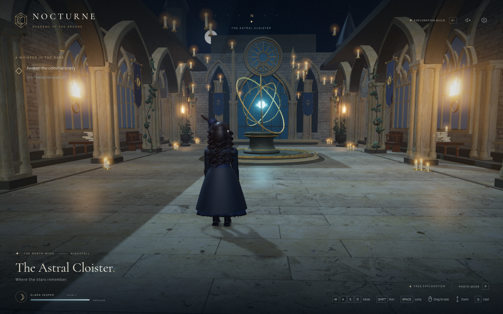

# Recovered Nocturne — The Astral Cloister

This is the original project recovered from the previous workspace, not a replacement implementation. The original source, assets, package lock, test suite, and existing production build were present. The game source was preserved unchanged.

## Screenshots

The original screenshot is preserved byte-for-byte:

[Open original screenshot](https://raw.githubusercontent.com/thietvedan-dotcom/hogwat-3d/main/screenshots/overview.png)

A fresh screenshot was captured from the recovered production build in Chromium:

[Open fresh browser screenshot](https://raw.githubusercontent.com/thietvedan-dotcom/hogwat-3d/main/screenshots/recovered-live.png)

The screenshots are real browser captures, not generated illustrations. Chromium reported a ready WebGL scene with no page errors or failed asset responses. Software rendering was used for verification; this does not benchmark desktop GPU performance.

Original overview SHA-256: `f33bdf3917086e8cd153116868657cdf686283540b2783172ea399e916141acf`.

See [README](README.md) for the original setup and controls. A GitHub source URL or screenshot URL is not a playable deployment; deployment must be verified separately.
